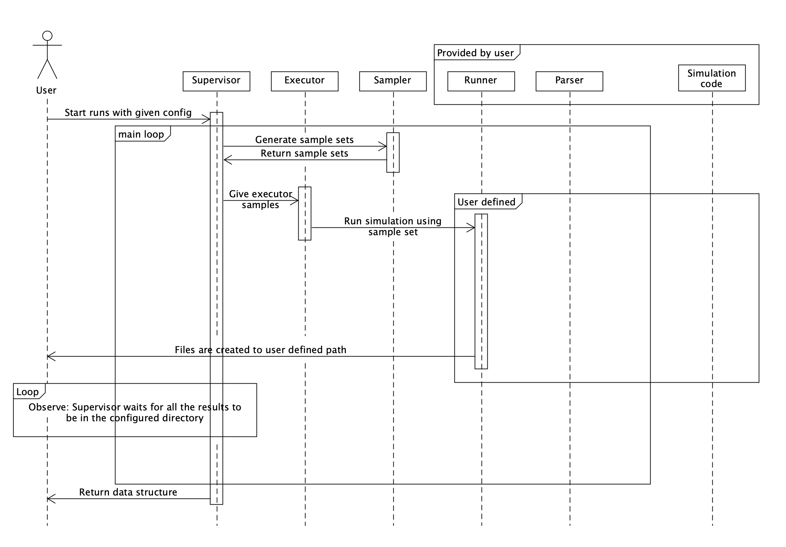
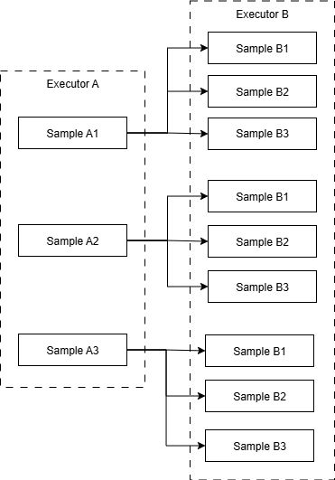

# Supervisor

Supervisor is where the main loop of Enchanted Surrogates is ran. Supervisor
orchestrates use of samplers, executors and runners. See the chart below for
overall structure of the code.



## Configuration of supervisor

Supervisor needs `base_run_dir` defined in the configuration file. Example as
follows:

```yaml
supervisor:
  base_run_dir: "path/to/folder"
  run_order:
    - executor: ...
      sampler: ...
      runner: ...
```

### Nested execution

Nested execution allows for running nested sampling schemes, which is useful
when one code is used to generate input for another code.



This type of workflow could be configured by

```yaml
executors:
  A: ...
  B: ...

samplers:
  SomeSampler: ...

runners:
  RunnerA: ...
  RunnerB: ...

supervisor:
  base_run_dir: ...
  run_order:
    - executor: A
      sampler: SomeSampler
      runner: RunnerA
    - executor: B
      sampler: SomeSampler
      runner: RunnerB
```

In this example configuration, the output of `RunnerA` can be used as input to
`RunnerB`. Executors, samplers and runners can be used multiple times in
different stages of the workflow, note that in this example, both runners use
`SomeSampler`.

See [example_nested.yaml](../configs/example_nested.yaml).

### Multi-runner sequential execution

Alongside nested executing, the supervisor also supports sequential sampling. In
sequential sampling, the sampler's batches are called once but the samples go
through multiple runners which pass information to each other. This is useful
for active learning use cases. Sequential sampling and nested sampling can be
used together in the same configuration.

To utilize sequential sampling in configurations, multiple runners need to be
defined in the config file as a list. The same applies to executors. The amount
of executors and runners defined in run_order must be equal. If this is not met,
an exception is thrown. Examples of sequential sampling are provided within the
configs directory under
[example_sequential.yaml](../configs/example.sequential.yaml).

Example of how a run_order can be defined to perform sequential sampling:

```yaml
supervisor:
  base_run_dir: "data_dir/sequential_local"
  run_order:
    - sampler: code1_sampler
      executor:
        - code1_executor
        - code2_executor
        - code3_executor
      runner:
        - code1_runner
        - code2_runner
        - code3_runner
```

### Resuming/extending previous runs

The supervisor supports seamlessly resuming a previous run, in case of crashes
or timeouts. The previous run can also be extended with more sample points if
desired. This is configured with the `run_mode` config option.

```yaml
supervisor:
  base_run_dir: ...
  run_mode: "fresh" # "resume" / "extend"
  run_order:
    - executor: ...
      sampler: ...
      runner: ...
```

#### "fresh"

Normal run and the default

#### "resume"

- Resume an interrupted previous run:
  - Set `run_mode: resume` under `Supervisor` in the config file, no other
    changes are needed.
  - Supervisor keeps track of the run state (how many batches sampled, which
    nesting depth, and how many samples have been submitted) and using this data
    restores the run from where it left off and continues from there.

- Resume a previous run that was completed but increase the budget:
  - Set run mode to resume and also increase the budget of the sampler. From
    Supervisor point of view, this is same as if the budget always was that much
    and the run was just interrupted.
  - Eg. increasing budget from 50 to 60 and re-running generates 10 new samples.

#### "extend"

- Extend a previous run:
  - Set `run_mode: extend` under `Supervisor` in the config file
  - Now setting sampler budget to 10 means that 10 new samples are created.

### HPC cluster local storage

Some partitions on some HPC clusters have access to local memory on the run
node. Setting the `local_storage` environment variable appropriately could
potentially improve I/O operation performance.

```yaml
supervisor:
  local_storage: TMPDIR
```

CSC users, see for example
https://docs.csc.fi/computing/disk/#temporary-local-disk-areas

### Optional attributes

Also, it is possible to define that enchanted_dataset summary file combining all
run results is parquet instead of csv. CSV is default and does not require any
configuration.

```yaml
supervisor:
  summary_datatype: "parquet" # csv by default
```

### Configuring output files

Enchanted surrogates creates lots of intermediate files and by default, all are
retained after execution. Keeping or automatically deleting these files can be
configured by `save_files` and `save_files_list` supervisor config options:

```yaml
supervisor:
  base_run_dir: ...
  save_files: "all" # or "custom" or "none"
  # if using custom, only the specified files are saved
  save_files_list:
    - enchanted_dataset.csv
    - example_local.csv
    - ...
```

Hdf5 storage file is not saved if type for it is None. It is created in every
other case.

```yaml
storage:
  type: "hdf5" # or "None"
```

It is possible to delete unnecessary files from base_run_dir and keep only
wanted files. By default all is saved. Option custom saves only described files.
None does not save any files.

**Note: `enchanted_dataset.csv`, `runs.h5` and `logs` are always saved.**

```yaml
supervisor:
  save_files: "all" # or "custom" or "none"
  # if using custom, only described files are saved
  save_files_list:
    - file.txt
    - file2.txt
```

See config folder for example configurations.
