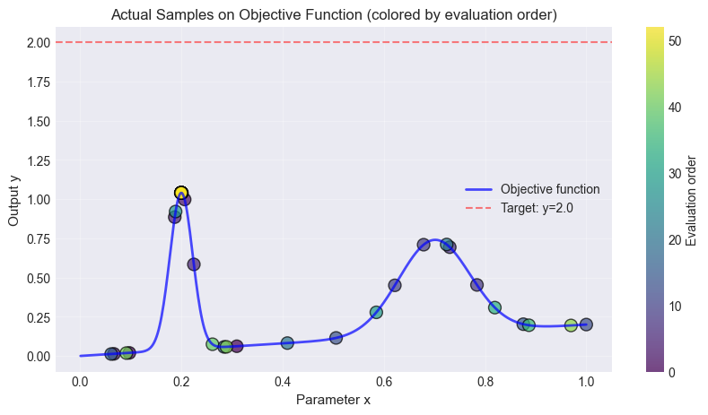

# Tutorial: Bayesian Optimization

This tutorial explains the example Bayesian optimization workflow in Enchanted Surrogates. The Bayesian optimization example is a synthetic test case that uses the [Example BO Runner](runners/example_bayesian_optimization_runner.md), the [Example BO Parser](parsers/example_bayesian_optimization_parser.md), and an example configuration file  (`configs/example_bayesian_optimization_local.yaml`).
Make sure that when you installed `enchanted-surrogates`, you included the optional dependencies needed for the [Bayesian Optimization Sampler](samplers/bayesian_optimization_sampler.md). 

## Explanation

This Bayesian optimization example aims to solve the problem "find $x$ that makes $f(x)$ closest to the target value $y_{target}$". In this example case, $y_{target} = 2.0$.

The example runner implements a **synthetic 1D objective function** defined as a linear term plus two Gaussian bumps. Note that in reality, the objective function is seldom one-dimensional or simple. 
The formula for the objective funtion in this example is:

$$
f(x) = a \cdot x + g_{11} \cdot \exp\left(-\frac{(x - g_{13})^{2}}{g_{12}}\right) + g_{21} \cdot \exp\left(-\frac{(x - g_{23})^{2}}{g_{22}}\right)
$$


The parameter values for the runner can be defined in the config file. This example uses the default parameters:

- $a = 0.2$ (linear slope)
- $g_{11} = 1.0, g_{12} = 0.001, g_{13} = 0.2$ (first Gaussian)
- $g_{21} = 0.6, g_{22} = 0.01, g_{23} = 0.7$ (second Gaussian)


The search space (bounds) for $x$, the number of samples (budget) and the aquisition function are defined in the sampler section of the config file.

```yaml
samplers:
  s1:
    type: BayesianOptimizationSampler
    budget: 50
    bounds: [[0.001, 1.0]]
    parameters: ['x']
    initial_samples: 3
    acquisition_function: LEI
    random_fraction: 0.5

```

In this example, the sampler starts by generating three `initial_samples`. These are three random points in the search space that serves are starting points for the optimization task. 

Each sample is passed to the runner, which evaluates the objective function $f(x_{sample})$. The samples and objective function evaluations (`output`) are passed to the parser. The parser scores each sample by how close `output` is to the target `2.0`.
In this case, the parser computes a simple distance metric:

$$
d = y_{target} - f(x_{sample})
$$

The combined run inputs and outputs are saved into `enchanted_datapoint.csv` after
each run. Having some initial random samples, the Bayesian Optimization phase can start. Firstly, the parser reads the existing `enchanted_datapoint.csv` files so the sampler can reconstruct the objective from past runs. Secondly, a Gaussian Process model is trained on the data and the acquisition function (e.g., LEI) suggests new promising points to evaluate. These points (samples) are evaluated and saved into `enchanted_datapoint.csv`.
The sampling and parsing is repeated until the budget is exhausted.


## Run the example

You should be able to run the example without needing to edit the configuration file. You might want to change the `base_run_dir` in the `supervisor` section to another path for saving the data.

```bash
cd enchanted-surrogates/
python src/run.py -cf configs/example_bayesian_optimization_local.yaml
```

This example should not take more than a couple seconds to run.

## Results


Load and analyze the results:

```python
import pandas as pd
import matplotlib.pyplot as plt

def objective_function(x, model_params=None):
    """Evaluate the synthetic objective function."""
    if model_params is None:
        model_params = [0.2, 1.0, 0.001, 0.2, 0.6, 0.01, 0.7]
    
    a, g11, g12, g13, g21, g22, g23 = model_params
    
    y = a * x
    y += g11 * np.exp(-(x - g13)**2 / g12)
    y += g21 * np.exp(-(x - g23)**2 / g22)
    
    return y

df = pd.read_csv('path/to/data_dir/bayesian/enchanted_dataset.csv')
df_clean = df.dropna(subset=['x', 'output'])
    
fig, ax = plt.subplots(1, 1, figsize=(10, 5))
x_dense_plot = np.linspace(0.001, 1.0, 500)
y_dense_plot = objective_function(x_dense_plot)

ax.plot(x_dense_plot, y_dense_plot, 'b-', linewidth=2, label='Objective function', alpha=0.7)
scatter = ax.scatter(df_clean['x'], df_clean['output'], c=range(len(df_clean)), cmap='viridis', s=100, alpha=0.7, edgecolor='black', linewidth=1)
cbar = plt.colorbar(scatter, ax=ax)
cbar.set_label('Evaluation order', fontsize=10)
ax.axhline(y=2.0, color='red', linestyle='--', alpha=0.5, label='Target: y=2.0')
ax.set_xlabel('Parameter x', fontsize=11)
ax.set_ylabel('Output y', fontsize=11)
```

The figure below shows the objective function, the initial random points and the accuired samples. It also displays the targed $y_{target}=2.0$ as a line. In this synthetic 1D example, it is clear that $f(x=0.2)$ is the value closest to the target. 





## Extending the example

You can adapt this example for a real simulation by:

- replacing `ExampleBayesianOptimizationRunner` with a runner that invokes your code
- implementing a parser that reads the real output files and defining your objective in `collect_sample_information`
- updating `bounds` and `parameters` to match your input space

