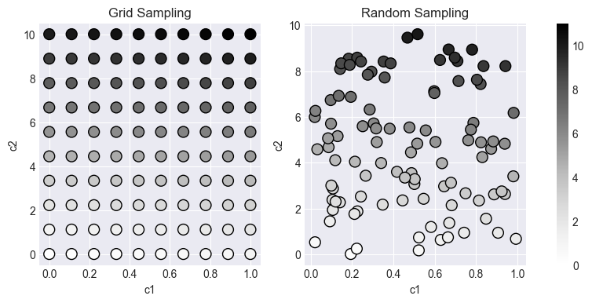

# Tutorial: Sampler comparison

This tutorial will demonstrate the difference between the `Random sampler` and the `Grid sampler` over a 2D parameter space. Given two input parameters, `c1` and `c2`, the 
Note that you need to have enchanted-surrogates installed when running this example.

Setup two new configuration files based on `configs/example_local.yaml`.

```bash
cd enchanted-surrogates/
cp configs/example_local.yaml configs/example_local_random.yaml
cp configs/example_local.yaml configs/example_local_grid.yaml   
```

Edit `example_local_random.yaml` to have parameters:

```yaml
samplers:
  s1:
    type: RandomSampler
    bounds: [[0.0, 1.0], [0.0, 10.0]]
    budget: 100
    parameters: ['c1', 'c2']

...

supervisor:
  base_run_dir: "data_dir/local_random"
  ...

```

  
Edit `example_local_grid.yaml` to have parameters:


```yaml
samplers:
  s1:
    type: GridSampler
    bounds: [[0.0, 1.0], [0.0, 10.0]]
    num_samples: [10, 10]
    parameters: ['c1', 'c2']

...

supervisor:
  base_run_dir: "data_dir/local_grid"
  ...

```

In the random sampler, the budget defined the total number of samples. In the grid sampler, the num_samples defiend how many samples per parameter. The total number of samples is the product of all values in num_samples. In this case 10*10=100.
The same number of samples have been configured for both cases.
The same parameters and parameters bounds have also been configured for both cases.

Run enchanted-surrogates with the new configs.

```bash
python src/run.py -cf configs/example_local_random.yaml

```
```bash
python src/run.py -cf configs/example_local_grid.yaml

```

This will create two separate directories, both containing 100 samples over the same parameter space but distributed differently.

Now we can take a look at the generated samples by reading the summary files `enchanted_dataset.csv`.

```python

import matplotlib.pyplot as plt
import matplotlib as mpl
import pandas as pd

# Read summary files csv
csv_path_grid = "data_dir/local_grid/enchanted_dataset.csv"
if os.path.exists(csv_path_grid):
    df_grid = pd.read_csv(csv_path_grid)

csv_path_random = "data_dir/local_random/enchanted_dataset.csv"
if os.path.exists(csv_path_random):
    df_random = pd.read_csv(csv_path_random)

fig, axs = plt.subplots(1, 2, figsize=(10, 4))

# Shared colorbar
vmin = min(df_grid['output'].min(), df_random['output'].min())
vmax = max(df_grid['output'].max(), df_random['output'].max())
norm = mpl.colors.Normalize(vmin=vmin, vmax=vmax)

sc_grid = axs[0].scatter(df_grid['c1'], df_grid['c2'], c=df_grid['output'], norm=norm, edgecolor='black', s=100)
sc_random = axs[1].scatter(df_random['c1'], df_random['c2'], c=df_random['output'], norm=norm, edgecolor='black', s=100)

axs[0].set_title('Grid Sampling')
axs[1].set_title('Random Sampling')

for ax in axs:
    ax.set_xlabel('c1')
    ax.set_ylabel('c2')

fig.colorbar(sc_random, ax=axs)
plt.show()

```

The above code snippet will create a figure that displays how the distribution of the sample points differ between the two samplers. The colorbar refers to the output value of the example runner (`c1 + c2`).



This example demonstrates only two of the available samplers. Which sampler to use depends on your application. 
